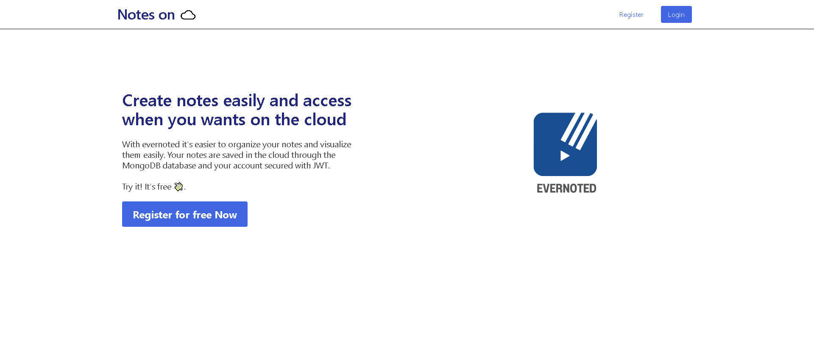
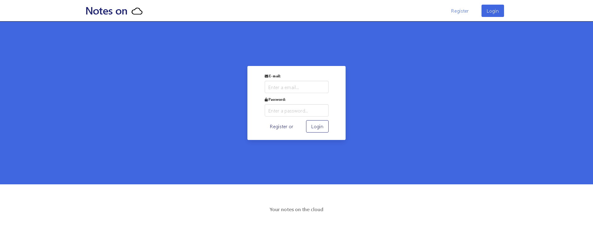
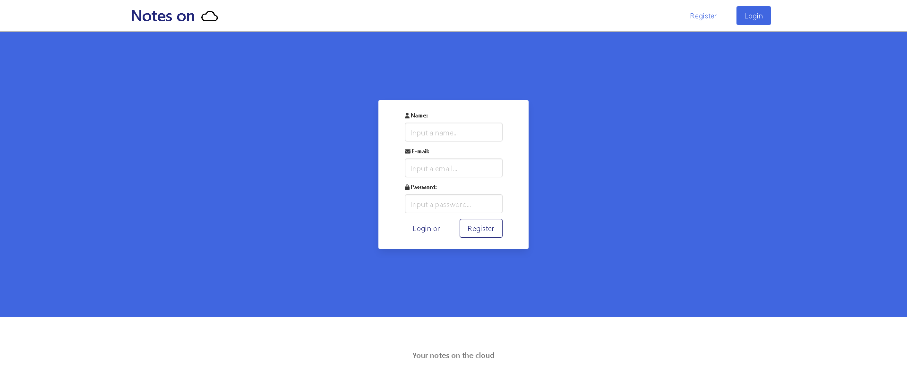
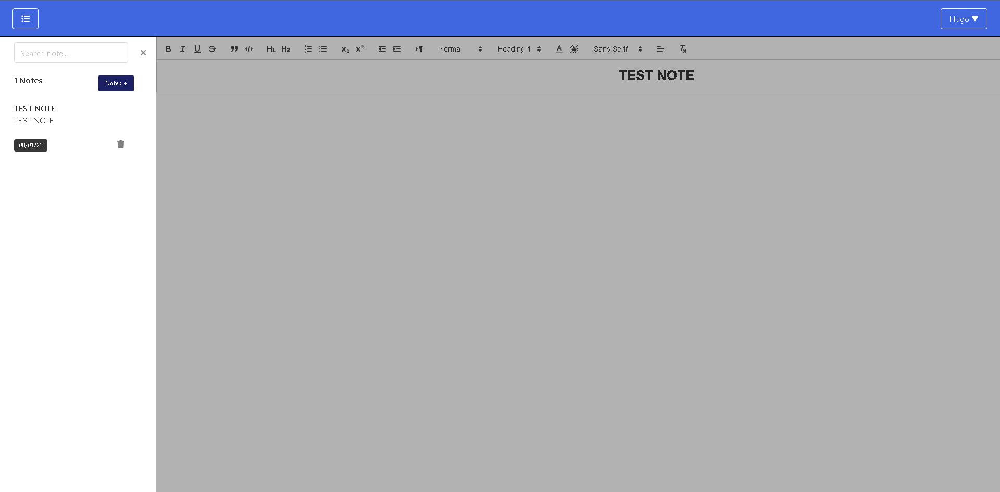

<h1>✒️Evernoted - Notes on cloud</h1>

<h4>Evernoted is a basic notes on cloud application done with the help of 8 weeks OneBitCode course</h4>

<h2>✨ Features:</h2>

 ✔️ Api for HTTP requests 

 ✔️ JWT Authentication 

 ✔️ Protected Routes 
  

 ✔️ Rbx components library

 ✔️ React Router 

 ✔️ Rich text for editing notes 

 ✔️ Vercel deploy (some corrections to be made in user routes) 

 ❌ Responsive application (pending)

 

<h2>🛠️ How Build?</h2>
<ul>
  <li>Add MONGO_DB_URI, JWT_TOKEN and JWT_EXPIRES variables in .env file of evernoted-api folder</li>
  <li>Run <code>npm start</code> to start api </li>
  <li>The default client port is <code>3006</code>. Change that in .env file of evernoted-client folder</li>
  <li>Run <code>npm start</code> to initialize the client </li>
</ul>

 

<h2>🚀 Deploy on Vercel:</h2>
<ul>
  <li>Client deploy: https://evernoted-client.vercel.app/</li>
  <li>Api deploy: https://evernoted-api.vercel.app/ </li>
</ul>

 

<h2>👨‍💻 Technologies:</h2>
<ul>
  <li> React </li>
  <li> Node.js </li>
  <li> Axios </li>
  <li> MongoDB (Mongoose) </li>
</ul>

 

<h2>💻 Screens:</h2>

  <h3 align="center">Home:</h3>
  

    
  

 

  <h3 align="center">Login:</h3>
  

    
  

  <h3 align="center">Register:</h3>
  

    
  

 

  <h3 align="center">Application:</h3>
  

    
  

 

  <h3 align="center">Edit Notes:</h3>
  

    
  

 

  <h3 align="center">Edit User:</h3>
  

    
  

